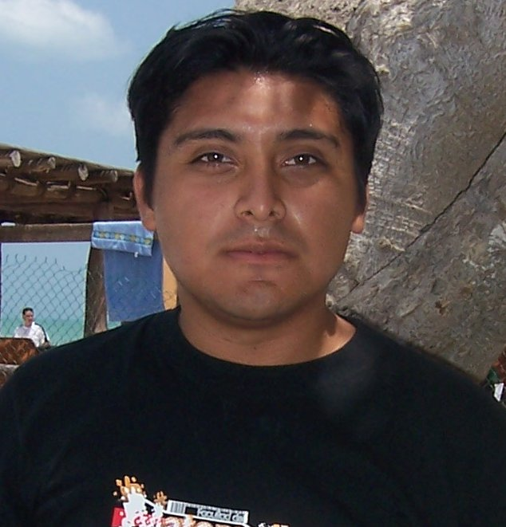

# OAW
Repositorio para el proyecto final de la asignatura optativa  
Optimizasión de Aplicaciones Web.  
Profesor: Dr. Víctor Hugo Menéndez Domínguez 

 Equipo:
  
  
  
* Francisco Javier Camas Tec.
